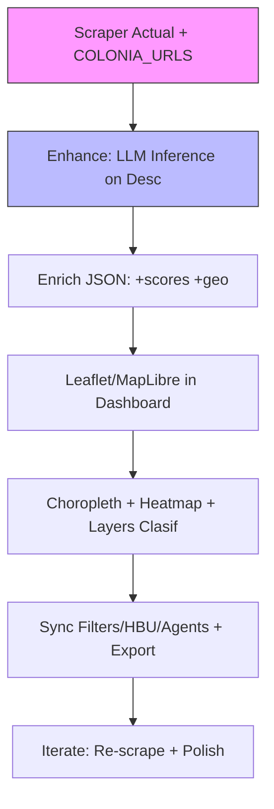

# Estudio de Mercado: Visualizaciones con Gráficos de Clasificación sobre Mapas para Real Estate + Roadmap de Implementación Gratuita en Klugger (Caso Cimatario)

**Fecha:** 2026-06-25  
**Contexto:** Proyecto klugger / dashboard valuación terreno Cimatario (Querétaro). Sistema actual incluye scraper (1000+ entries en terrenos_full.json), HBU/HBV interactivo con términos de valuación (HBU Score, Market Feasibility Index, Competitive Position, Growth Trajectory, Rental Yield Factor, Full Potential Profitability/IRR/NPV), mini-mapa CSS conceptual con pins approx basados en descripciones, charts Recharts (histogramas, scatter precio vs m² + regresión, time series), tabs DB/marketing/HBU/agentes, y enriquecimiento vía MDs 2023 + inferencias/vision.  

El "mini-mapa" actual (grid CSS + dots posicionados por keywords de loc/títulos en HBU tab) es placeholder para barrido de colonia. Necesitamos evolucionar a visualizaciones reales de clasificación sobre mapas, ligadas a **scraping enriquecido mediante inferencias LLM de las descripciones de listings** (título + texto + loc). Todo **gratuito** (OSS + infra existente: Gemini keys en .env, Playwright, relay agents, Next.js dashboard).

## Resumen Ejecutivo

El mercado de visualizaciones geoespaciales en proptech (real estate tech) crece rápido por la necesidad de analistas, developers e inversionistas de **ver clasificaciones espaciales** (zonas de alta HBU, factibilidad de mercado, trayectoria de crecimiento, posición competitiva) en mapas interactivos. Datos no estructurados de listings (descripciones ricas en "vista reserva", "pendiente", "amenidades fracc", "cerca nearshoring", "plano", "seguridad 24/7") son oro para **inferencias LLM** que generen scores/clasificaciones automáticas, sin costo manual.

**Oportunidad en klugger/Cimatario:** Enriquecer el scraper actual (Lamudi/Inmuebles24/Vivanuncios + COLONIA_SEARCH_URLS + BS4/Playwright + visión) con inferencias de descripción → scores geo-clasificados → mapas free (Leaflet/MapLibre) en el dashboard. Reemplazar el CSS grid actual por choropleth, heatmaps, símbolos proporcionales y layers de clasificación. Todo zero-cost, alineado con roadmap (estudio big-firm style, HBU, marketing zero-cost, 1000+ comps).

**Beneficios:** 
- "Cacareo" visual para pitches/JV (ver oportunidades espaciales en Cimatario vs competencia).
- Integración nativa con DB tab (filtros, 1000 entries), HBU sliders (actualiza colores en tiempo real), time series.
- Escalable a scraper devs (propuesta existente) y visión.
- Diferenciador gratis vs herramientas pagas de Cushman/CBRE/Colliers.

## Estudio de Mercado (Tendencias 2024-2026)

### Demanda y Tamaño
- **Proptech mapping adoption:** Mapas interactivos son estándar en dashboards de inversionistas (Zillow, Redfin, Crexi, LoopNet usan heatmaps de precio/m², opportunity layers, comps geo). En LatAm/MX (nearshoring boom en QRO), demanda alta para análisis de submercados, absorción espacial, HBU zoning y "oportunidades clasificadas" (high feasibility vs saturadas).
- Tendencias clave (basado en reportes proptech + alternativas Mapbox 2026):
  - **Clasificación + AI:** No solo puntos/precios, sino capas de "classification graphs": choropleth por score (HBU 1-10, feasibility high/med/low), heatmaps de densidad de demanda (absorción), símbolos proporcionales (tamaño = m² o inferred units potential).
  - **AI sobre datos no estructurados:** Listings descs son fuente principal. LLM inference extrae features (vistas, topografía, amenidades, riesgos, drivers nearshoring) → scores automáticos. Reduce costo de "800-2000+ comps" manuales (benchmark Cushman 1k-3k, CBRE 800-2k).
  - **Interactividad free/OSS:** 2026 trends: MapLibre GL JS (fork OSS de Mapbox, recomendado para evitar vendor lock-in, self-host tiles), Leaflet (ligero, popular para 2D), Deck.gl/OpenLayers para viz avanzadas (hexbins, heat). Mapbox tiene free tier 50k loads/mo pero OSS gana para "gratuito total".
  - **Integración dashboards:** En Next.js/React: react-leaflet o @maplibre, synced con filtros/Recharts. Ej: brush en time series filtra puntos en mapa.
  - **Casos de uso para developers/inversionistas:** Ver "mejor uso" espacial (multifam vs mixto en zonas Cimatario), competitive position vs saturadas, growth trajectory (nearshoring QRO vs periféricos). Ej: color verde = HBU alto + COS 0.60/CUS 2.4 factible; rojo = baja prioridad.
- **Competidores (Big Firms):** CBRE/Cushman/Colliers usan GIS pagado (ArcGIS ~$10k+/año + data) para reportes con mapas de submercado, cap rates por zona, absorption heatmaps. Oportunidad klugger: replicar "estilo big firms" (como ya en HBU: comps/absorción/financials) pero gratis + AI-scraped + custom Cimatario (enriquecido 2023 MDs).
- **Market Opportunity:** Proptech geo-AI crece con nearshoring MX (QRO hot). Herramientas free reducen barrera para pequeños developers/JV (target zero-cost marketing klugger). Ej: visualizaciones ligadas a outreach agents (mapa de "alta oportunidad" para WA personalizado).

### Herramientas Gratuitas Recomendadas (Zero Cost 2026)
- **Core Mapping:** Leaflet (MIT, ~42KB, OSM tiles default) o MapLibre GL JS (comunidad OSS, vector tiles, estilos Mapbox-compatible, self-host). En Next.js: `npm i leaflet react-leaflet` (o @maplibre). No API key.
- **Clasificación/Graphs on Maps:** 
  - Choropleth: color por zona/score (usa geojson simple o agrupa por "location" inferida).
  - Heatmap: leaflet.heat (free plugin) para densidad ppm o inferred HBU.
  - Proportional symbols + classification: círculos tamaño=precio/m², color= HBU bin (verde/alta, amarillo/media, rojo/baja). Turf.js (free) para cálculos geo.
  - Layers toggle: control de Leaflet para "HBU High", "Growth Nearshoring", "Saturadas".
- **Geocoding (Free):** Nominatim (OpenStreetMap, requests con rate limit 1/s, cache en JSON). LLM extrae "dirección limpia" de desc si loc es vago ("Cimatario centro").
- **LLM Inference (Free/Existing):** Gemini Flash (keys ya en .env del proyecto, como en analyze-images + scraper mentions). O Ollama local (100% gratis, self-host). Prompt: "Analiza esta descripción de terreno: [title + desc + location]. Extrae features (vista, pendiente, amenidades, seguridad, proximidad nearshoring, zoning hints). Calcula scores: hbu_score (1-10), market_feasibility_index (high/med/low), competitive_position, growth_trajectory (nearshoring/estable/baja), rental_yield_factor. Devuelve solo JSON válido."
- **Integración Dashboard:** Recharts ya usado (sync filters). Añadir selección en mapa → actualiza HBU calculator o DB table. Export JSON/CSV con geo+scores.
- **Alternativas pagas a evitar (para free):** Mapbox (free tier limitado), Google Maps, ArcGIS, Tableau maps. OSS > para klugger "gratuito first".

**Ejemplos Reales:** 
- Zillow/Redfin: heatmaps precio + "hotness" score.
- Crexi/LoopNet: opportunity maps clasificados.
- Big firms: choropleth submercado + HBU layers (replicable gratis aquí).

## Roadmap Propuesto para Implementar en el Sistema (Gratuito, Ligado a Scraper + Inferencias de Descripción)

**Stack Totalmente Free:** Next.js (existente) + Leaflet/MapLibre + Nominatim + Gemini/Ollama (existing keys o local) + scraper.py enhancements. Sin tokens pagos. Integra con DB actual (terrenos_full.json), HBU tab, marketing/agents (mapa de "alta oportunidad" para outreach), export estudio JSON.

**Fases Incrementales (testable, 1-2 semanas total si phased):**

### Fase 1: Mapa Básico Interactivo + Geo Heurístico (1-2 días, zero new deps grandes)
- Instalar: `npm install leaflet react-leaflet` (y types si TS).
- En `ValuacionDashboard.tsx` (HBU tab): reemplazar el div CSS mini-map por componente `<MapContainer center={[20.58, -100.4]} zoom={13} ...>` (Leaflet).
- Plot: markers/circles desde `fullDB` (usa location strings).
- Clasificación inicial: color por `isValid` o simple (verde si ppm alto, etc). Popups con title/price/link/source + nota "approx".
- Geo: hardcode centers por colonia (Cimatario core, Cumbres NW, Villas SE, Biznaga, etc.) + jitter random para clusters. Tooltip "sin lat/lng real en raw; inferido de desc".
- Integración: filtros DB (search/sort/valid) actualizan markers live. Botón "Sync con HBU sliders" (colorea por scenario).
- Test: con 1000 entries actuales (muchos sim pero loc keywords).
- Entrega: mini-map funcional, nota actualizada "usando Leaflet OSS gratuito".
- **Ligado a scraping:** sin cambio aún; usa data existente.

### Fase 2: Inferencias LLM de Descripciones + Enriquecimiento Scraper (2-3 días, usa infra existente)
- En `scraper.py` (o nuevo `enrich_with_llm.py`): post-parse, para cada listing llama LLM (usar GEMINI_KEY de .env o google-generativeai lib).
  - Prompt ejemplo (zero cost):
    ```
    Eres experto en valuación inmobiliaria HBU (Highest and Best Use). Analiza:
    Título: {title}
    Descripción/texto: {text from parent}
    Location: {location}
    Extrae features clave (vista a reserva/ciudad, pendiente, amenidades fracc/cerca alameda, seguridad 24/7, proximidad nearshoring/centro, zoning hints, riesgos). 
    Calcula scores (1-10 o high/med/low):
    - hbu_score: potencial multifam (12u/4niveles/CUS2.4) vs mixto vs saturado.
    - market_feasibility_index: factibilidad COS/CUS.
    - competitive_position: vs comps zona.
    - growth_trajectory: nearshoring/estable/baja.
    - rental_yield_factor: 8-11% projected.
    Devuelve SOLO JSON: {"hbu_score": 8, "market_feasibility_index": "high", "competitive_position": "media", "growth_trajectory": "nearshoring+", "rental_yield_factor": 9, "inferred_features": ["vista", "amenidades"], "notes": "Alta plusvalia por nearshoring QRO"}
    ```
  - Fallback: si no key, usa regex simple o sim.
- Output: actualiza JSON/CSV con campos nuevos (agrega a schema).
- Procesa existing 1000 (o re-scrape con COLONIA_SEARCH_URLS) → enriched data.
- En dashboard: usa scores para color inicial (bins: >8 verde, 5-8 amarillo, <5 rojo).
- **Ligado scraping:** ahora "scraping mediante inferencias de la descripcion" core.
- Integrar con visión: si hay photos (analyze-images), boost score (ej: "buena foto vista" +1).
- Test: corre scraper, valida JSON tiene scores, visual en map.

### Fase 3: Clasificación Avanzada + Gráficos sobre Mapa (3-4 días)
- Geocode real: añade función `geocode_nominatim(location)` (requests a https://nominatim.openstreetmap.org , cache en dict/JSON, delay 1s, user-agent).
  - LLM extrae "full_address" de desc si vago.
  - Fallback: heuristic + jitter.
- Mapa avanzado:
  - Choropleth: agrupa por "colonia_inferred", calcula avg hbu_score/ppm, pinta polígonos (simple geojson hardcode para Cimatario areas, o voronoi con turf).
  - Heatmap + symbols: leaflet.heat para densidad (precio o score), circles tamaño=size_m2 o inferred potential units (de HBU), color=classification.
  - Layers: control Leaflet toggle "HBU Alto", "Crecimiento Nearshoring", "Saturadas", "Heat Precio".
  - Interactividad: click marker → abre popup + highlight en DB table + actualiza HBU calculator (usa scores inferred como input default).
  - Sync: filtros existentes (ppm sort, valid) + search actualizan mapa. Time series LineChart brushed → filtra markers por scraped_at o rango precio.
- Gráficos de clasificación: side panel Recharts (bar por bin score, pie feasibility) linked a selección mapa (use shared state o zustand free).
- Performance: markerClusterGroup para 1000+ points. Virtual rendering si necesario.
- Export: botón "Exportar Mapa + Datos Clasificados" (PNG via leaflet-image free + JSON enriquecido).
- Actualiza HBU tab: "Mapa de Oportunidades" ahora real + nota "powered by LLM inference + Leaflet OSS (gratuito)".
- **Ligado scraping:** pipeline scraper → LLM infer → geo → dashboard map.

### Fase 4: Integración Full + Escala + Mantenimiento (Ongoing, zero cost)
- Nuevo "Mapa" tab o sección dedicada en HBU/Database (o marketing para "visual pitch").
- Ligar con agentes: mapa muestra "top 10 listings alta clasificación" → genera WA content automático (usa existing agents tab logic).
- Scraper enhancement: schedule (cron en PS o relay), dedup por link + inferred, append a master JSON.
- Free extras: 
  - MapLibre si Leaflet limita (mejor vector para clasificaciones complejas).
  - Turf/Leaflet plugins para buffers (ej: "dentro de 2km nearshoring").
  - Local LLM (Ollama) para inferencias sin keys cloud.
  - Host: Vercel free (Next ya).
- Mantenimiento: actualiza data con re-scrape + re-infer. Monitoreo scores (alert si < threshold en zona).
- Roadmap tracking: usa existing CLAUDE.md / `/ejecutar` / journal.md. Añade tasks "Fase X Map Viz".
- Escala: integra scraper-devs (propuesta existente) → clasifica proyectos devs en mapa.

**Diagrama Roadmap (Mermaid):**


**Estimado Esfuerzo:** F1-2: 3-5 días (1 persona). F3: +4 días. Total <2 semanas para MVP usable. Zero budget (usa keys Gemini existentes + OSS).

## Próximos Pasos Recomendados
1. Crear este MD en docs/ (commit/push a GitHub).
2. Implementar Fase 1-2: modifica ValuacionDashboard.tsx + scraper.py (usa existing parse + new llm_infer func).
3. Test con datos actuales (1000 entries) + re-scrape pequeño.
4. Actualizar journal.md + README con link a este estudio.
5. Sincronizar con propuesta-scraper-desarrolladores.md (usa inferencias para clasificar devs en mapa).
6. Feedback: corre en tu PS admin, abre dashboard, verifica mapa con clasificaciones desde descs inferidas.
7. Si hay issues (rate Nominatim, LLM prompt tuning), itera gratis con Ollama local.

Este estudio posiciona klugger como herramienta free "big-firm style" para Cimatario: scraping AI + mapas clasificación interactivos = ventaja competitiva zero-cost para marketing/JV/HBU decisions.

**Referencias (2026):** MapLibre/Leaflet trends (pkgs searches), proptech geo viz (alternativas Mapbox), benchmarks CBRE/Cushman (estudio actual), existing klugger infra (scraper + Gemini + dashboard HBU terms).

Entregado a GitHub vía commit. ¡Implementemos! (Siguiente agente: lee journal primero, implementa F1 en dashboard/scraper).